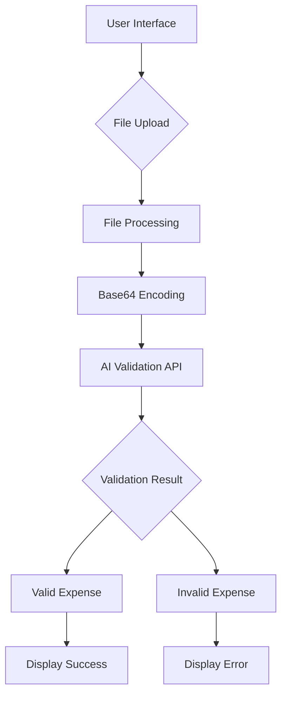
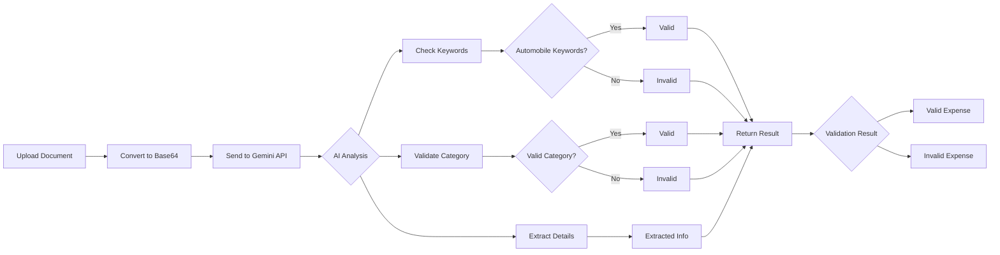

# 🚗 AutoBill Validator Pro

<p align="center">
  
  
  
</p>

<p align="center">
  <strong>Automobile-Only Expense Verification System</strong><br>
  Validate your automobile bills with AI-powered precision
</p>

## 🌟 Overview

AutoBill Validator Pro is an advanced web application that uses AI technology to validate automobile-related expenses. The system strictly accepts only automobile expenses and automatically rejects all other document types.

<div align="center">


</div>

## ✨ Key Features

### 🔍 **Smart Validation**
- AI-powered document analysis
- Strict automobile-only validation
- Instant results with detailed feedback

### 🎨 **Beautiful UI/UX**
- Light/Dark theme toggle
- Responsive design for all devices
- Animated transitions and visual feedback
- Intuitive drag & drop interface

### 🔊 **Audio Feedback**
- Horror-themed sound effects
- Volume control customization
- Visual alarms for validation results

### 📱 **Cross-Platform**
- Desktop and mobile friendly
- Touch and mouse support
- Optimized performance

## 🚀 Getting Started

### Prerequisites
- Modern web browser (Chrome, Firefox, Safari, Edge)
- Internet connection for AI API access

### Installation
1. Clone the repository:
   ```bash
   git clone https://github.com/yourusername/autobill-validator.git
   ```

2. Navigate to the project directory:
   ```bash
   cd autobill-validator
   ```

3. Open `index.html` in your web browser

### Usage
1. **Upload a Bill**
   - Drag & drop your bill file or click to browse
   - Supported formats: JPG, PNG, PDF, TXT, DOCX

2. **Preview Document**
   - Click "Preview Bill" to view your uploaded document
   - Image files open in a modal viewer

3. **Validate Expense**
   - Click "Validate Expense" to process with AI
   - Receive instant validation results

## 📋 Supported Expense Categories

### ✅ **Valid Automobile Expenses**
- Car maintenance and servicing
- Vehicle insurance payments
- Car repairs (engine, transmission, body work)
- Tire replacement and rotation
- Car battery replacement
- Fuel purchases (petrol, diesel, CNG)
- Engine oil and lubricants
- Car washing and detailing
- Parking fees for vehicles
- Highway toll charges
- Car accessories (seat covers, GPS, dash cams)
- Vehicle registration fees and road tax
- Car loan/EMI payments
- Emission tests and pollution certificates

### ❌ **Automatically Rejected**
- Grocery bills and food receipts
- Medical bills and healthcare expenses
- Rent and utility bills
- Clothing and shopping receipts
- Electronics and appliances
- Home maintenance and repairs
- Education fees and books
- Entertainment and event tickets
- Travel expenses (flights, hotels)
- Phone and internet bills
- Personal care and cosmetics
- Gifts and donations
- Sports equipment and hobbies
- Pet expenses and veterinary bills
- Office supplies and business expenses
- Non-vehicle insurance

## 🎨 UI/UX Showcase

### Light Theme
```
┌─────────────────────────────────────────────┐
│  🌞 Light Theme                             │
│                                             │
│  [Upload Area]    [Document Preview]        │
│  ┌────────────┐   ┌─────────────────────┐   │
│  │    📄     │   │      Preview        │   │
│  │ Drag & Drop│   │      Card           │   │
│  │    Here    │   │                     │   │
│  └────────────┘   └─────────────────────┘   │
│                                             │
│  [Validate] [Preview] [Clear]               │
└─────────────────────────────────────────────┘
```

### Dark Theme
```
┌─────────────────────────────────────────────┐
│  🌙 Dark Theme                              │
│                                             │
│  [Upload Area]    [Document Preview]        │
│  ┌────────────┐   ┌─────────────────────┐   │
│  │    📄     │   │      Preview        │   │
│  │ Drag & Drop│   │      Card           │   │
│  │    Here    │   │                     │   │
│  └────────────┘   └─────────────────────┘   │
│                                             │
│  [Validate] [Preview] [Clear]               │
└─────────────────────────────────────────────┘
```

## 📱 Responsive Design

### Desktop View
```
┌─────────────────────────────────────────────────────────────┐
│  Header with Logo                                           │
├─────────────────────────────────────────────────────────────┤
│  [Upload Section]         [Preview Section]                 │
│  ┌─────────────────┐      ┌─────────────────────────────┐   │
│  │                 │      │                             │   │
│  │   Upload Area   │      │    Document Preview         │   │
│  │                 │      │                             │   │
│  └─────────────────┘      └─────────────────────────────┘   │
│                                                             │
│  [Validate Expense] [Preview Bill] [Clear All]              │
└─────────────────────────────────────────────────────────────┘
```

### Mobile View
```
┌──────────────────────────────────────────┐
│  Header with Logo                        │
├──────────────────────────────────────────┤
│  [Upload Section]                        │
│  ┌────────────────────────────────────┐  │
│  │                                    │  │
│  │          Upload Area               │  │
│  │                                    │  │
│  └────────────────────────────────────┘  │
├──────────────────────────────────────────┤
│  [Validate] [Preview] [Clear]            │
├──────────────────────────────────────────┤
│  [Preview Section]                       │
│  ┌────────────────────────────────────┐  │
│  │                                    │  │
│  │        Document Preview            │  │
│  │                                    │  │
│  └────────────────────────────────────┘  │
└──────────────────────────────────────────┘
```

## 🔧 Technical Architecture



### Frontend Technologies
- **HTML5** - Semantic markup and structure
- **CSS3** - Advanced styling and animations
- **JavaScript (ES6+)** - Interactive functionality
- **Web APIs** - File handling, audio, fetch

### AI Integration
- **Google Gemini API** - Document analysis and validation
- **Base64 Encoding** - File preparation for API
- **JSON Communication** - Data exchange format

## 🔊 Audio System

### Sound Effects
- **Success Sound** - Ghostly whisper with chime for valid expenses
- **Error Sound** - Horror movie scream for invalid expenses
- **Volume Control** - Adjustable audio levels

### Visual Alarms
- **Success Animation** - Pulsing green glow for valid bills
- **Error Animation** - Intense red pulsing for invalid bills

## 🎨 Color Schemes

### Light Theme Palette
| Element | Color | Hex |
|---------|-------|-----|
| Primary | Blue | `#2563eb` |
| Success | Green | `#10b981` |
| Warning | Amber | `#f59e0b` |
| Danger | Red | `#ef4444` |
| Background | Light Blue Gradient | `#e0f2fe` to `#f0f9ff` |

### Dark Theme Palette
| Element | Color | Hex |
|---------|-------|-----|
| Primary | Blue | `#3b82f6` |
| Success | Green | `#34d399` |
| Warning | Amber | `#fbbf24` |
| Danger | Red | `#f87171` |
| Background | Dark Blue Gradient | `#0c1424` to `#111827` |

## 🔒 Privacy & Security

- **Client-Side Processing** - Files processed locally when possible
- **Secure API Communication** - HTTPS encryption for AI validation
- **No Data Storage** - Files are not stored on servers
- **Privacy Focused** - Minimal data collection

## 🤖 AI Validation Process



## 📈 Performance Metrics

- **Validation Speed** - Results in 2-5 seconds
- **File Size Limit** - Up to 10MB
- **Supported Formats** - JPG, PNG, PDF, TXT, DOCX
- **Browser Support** - All modern browsers
- **Mobile Optimization** - Fully responsive design

## 🛠️ Customization

### Theme Customization
```css
:root {
  --primary: #2563eb;        /* Primary color */
  --success: #10b981;        /* Success color */
  --warning: #f59e0b;        /* Warning color */
  --danger: #ef4444;         /* Danger color */
  --text-primary: #1e293b;   /* Primary text */
  --card-bg: rgba(255, 255, 255, 0.95); /* Card background */
}
```

### Animation Controls
```css
@media (prefers-reduced-motion: reduce) {
  * {
    animation-duration: 0.01ms !important;
    animation-iteration-count: 1 !important;
    transition-duration: 0.01ms !important;
  }
}
```

## 🤝 Contributing

1. Fork the repository
2. Create your feature branch (`git checkout -b feature/AmazingFeature`)
3. Commit your changes (`git commit -m 'Add some AmazingFeature'`)
4. Push to the branch (`git push origin feature/AmazingFeature`)
5. Open a pull request

## 📄 License

This project is licensed under the MIT License - see the [LICENSE](LICENSE) file for details.

## 👨‍💻 Author

**Made by Satyajit**

## 🙏 Acknowledgments

- Google Gemini API for AI validation
- Font Awesome for icons
- Google Fonts for typography
- All contributors and users

## 📞 Support

For support, email [your-email@example.com](mailto:your-email@example.com) or open an issue in the repository.

---

<p align="center">
  <strong>🚗 Validate Your Automobile Expenses with Confidence! 🚗</strong>
</p>

<div align="center">
  


</div>